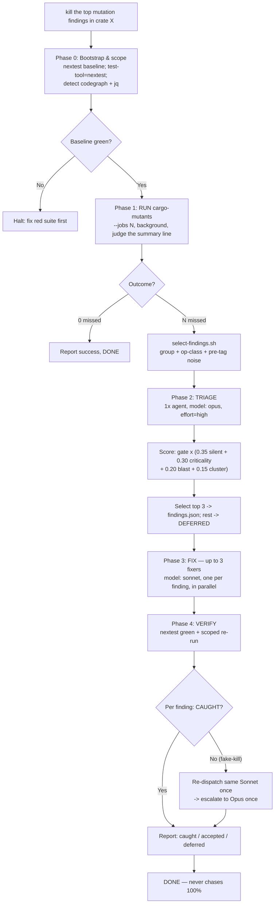

# mutation-killing-orchestrator

A [Claude Code](https://claude.com/claude-code) skill that turns mutation testing on Rust crates
from *"run it, read a wall of survivors, hand-write tests"* into an **intelligent, model-tiered
orchestration**: the smartest model judges, cheaper models execute.

> **The One Rule.** Rank surviving mutants by real-world impact, kill up to the top three, defer the
> rest honestly — never chase 100%, and never spend a test killing an equivalent mutant.

It runs [`cargo-mutants`](https://github.com/sourcefrog/cargo-mutants), triages the survivors by
impact in one Opus pass, dispatches Sonnet agents to write the killing tests, and verifies with a
single scoped re-run — re-dispatching or accepting only what's left.

---

## Why

Mutation testing tells you which lines your tests don't really exercise, but a real run can leave
hundreds of survivors. Most are noise (proof harnesses, label/`Display` mutants, measure-zero float
boundaries) or equivalent mutants no test can kill. The few that matter are **silent arithmetic
flips on money/health quantities** — a `*` that became a `/` with no panic and no compile error.

This skill encodes that triage. Its rubric is derived from four real-world mutation runs across
financial-ledger and health-calculation codebases, where the high-impact survivors were
consistently arithmetic mutations on critical quantities, and ~78 raw misses collapsed to ~8
test-shaped clusters (one known-value test kills a whole formula's swaps).

## Requirements

| Tool | Why |
|---|---|
| [`cargo-mutants`](https://github.com/sourcefrog/cargo-mutants) **27.0.0+** | Runs the mutation testing. The skill reads its `outcomes.json`. |
| [`jq`](https://jqlang.github.io/jq/) | Deterministic grouping/parsing of survivors. **Hard requirement** — scripts error if absent. |
| [`cargo-nextest`](https://nexte.st/) | The test runner cargo-mutants drives, and the baseline gate. |
| Claude Code with a per-agent `model:` override (the `Task`/Agent tool) | Dispatches the Opus triage and Sonnet fixers. |
| [codegraph](https://github.com/) *(optional)* | Blast-radius fan-in. Falls back to `ripgrep` when absent. |

## Install

Clone or copy the skill into your Claude Code skills directory:

```bash
git clone https://github.com/<you>/mutation-killing-orchestrator \
  ~/.claude/skills/mutation-killing-orchestrator
chmod +x ~/.claude/skills/mutation-killing-orchestrator/scripts/*.sh
```

Verify the install:

```bash
~/.claude/skills/mutation-killing-orchestrator/scripts/self-test.sh
# -> self-test: 36 passed, 0 failed
```

## Usage

Invoke it from Claude Code by intent, e.g.:

> *"kill the top mutation findings in crate `billing`"*
> *"triage the mutation survivors and write tests for the worst ones"*

It deliberately **cedes** the *run mutation testing / find missed mutants* intent to the companion
`cargo-mutants` skill — this one is for **ranking and killing** existing survivors.

Typical flow on a crate with survivors:

1. Baseline `nextest` must be green (it halts on a red suite).
2. Runs `cargo mutants` scoped to a package, file, or `--in-diff`.
3. Ranks survivors, picks the **top 3** (override with `--top N`).
4. Writes one killing test per finding (left **staged, not committed**).
5. Re-runs scoped, reports caught / accepted-equivalent / deferred.

## How it works — a 4-phase, model-tiered spine



| Phase | Model | What |
|---|---|---|
| 0 — Bootstrap | session orchestrator | scope, gitignore `mutants.out/`, nextest baseline, detect codegraph/jq |
| 1 — Run | deterministic shell | reuse cargo-mutants, judge from the summary line |
| 2 — Triage | **1× Opus**, effort high | score every survivor, drop noise, accept equivalents, pick top 3 |
| 3 — Fix | **up to 3× Sonnet**, parallel | one killing test per finding against a known playbook |
| 4 — Verify | orchestrator + escalation | scoped re-run, re-dispatch/escalate only what didn't kill |

## The impact rubric

```
impact = killability_gate × (0.35·silent_severity + 0.30·criticality + 0.20·blast_radius + 0.15·cluster_size)   → 0..5.0
```

| Dimension | Weight | Measured from |
|---|---|---|
| Silent-regression severity | 0.35 | op-class — arithmetic swap = 5; comparison/boolean/unary/`FnValue` = 3; label = 1 |
| Business-criticality domain | 0.30 | money / health / identity / data-integrity keyword match |
| Blast radius (fan-in) | 0.20 | codegraph callers (ripgrep fallback): ≥10/public = 5; 3–9 = 3; 1–2 = 1 |
| Cluster size (kills-per-test) | 0.15 | raw mutants on the same `(file, function, line)`: ≥8 = 5; 4–7 = 3; 1–3 = 1 |
| Killability gate | ×0 / ×1 | ×0 → accept if no input both reaches the line and observes a different result |

> The op-class can't be read from `outcomes.json`'s `.replacement` field (that's the *new* token only)
> — arithmetic, comparison, and boolean swaps all share `genre == "BinaryOperator"`. The skill parses
> the original→new swap out of the mutant's `.name` instead.

## What's in the skill

| Path | Purpose |
|---|---|
| `SKILL.md` | Routing spine: frontmatter, the 4-phase + dispatch tables, rubric summary, anti-patterns. |
| `references/IMPACT-RUBRIC.md` | Full rubric, op-class derivation, domain keywords, blast-radius procedure, accepted taxonomy, the float-tolerance trap. |
| `references/PLAYBOOK.md` | The 8 mutant→test recipes (stable `playbook_shape` tokens). |
| `references/ORCHESTRATION.md` | Dispatch contract, triage + fixer prompts, `findings.json` / `verify.json` schemas, escalation ladder, resume mechanics. |
| `scripts/select-findings.sh` | Deterministic `jq` grouping + op-class parse + noise pre-tag → grouped JSON. |
| `scripts/verify-rerun.sh` | nextest-green → scoped re-run → per-finding caught/missed → `verify.json`. |
| `scripts/self-test.sh` | Install integrity, drift guards, and a deterministic end-to-end smoke. |

## The 8 playbook shapes

`label-enum` · `threshold-le` · `threshold-flip` · `predicate-bool` · `formula-op` ·
`validate-stub` · `comparator-key` · `conversion-stub` — each a one-line mutant→test recipe (see
`references/PLAYBOOK.md`).

## Design choices worth knowing

- **Top-3 by default.** The goal is the highest-impact survivors, honestly reported — not a 100%
  kill ratio. Override with `--top N`.
- **Tests are staged, never committed.** You review and commit.
- **Equivalent mutants are report-only.** Writing `exclude_re` into `.cargo/mutants.toml` needs
  explicit per-repo approval — never silent.
- **Deterministic where it can be.** `jq` does the grouping, op-class parsing, cluster sizing, and
  noise pre-tagging; the Opus agent only does the judgment a script can't (criticality, blast
  radius, equivalence arguments, scoring).
- **Resumable.** Per-finding `status` + a `verify.json` sidecar + a monotonic promotion ledger let a
  run resume after compaction without duplicating tests or looping.

## Optional: multi-engine workflow

The default engine is direct agent dispatch and works in any Claude Code session. If your host has a
`Workflow` tool and you opt in, the orchestrator can instead deploy `workflow/pipeline.js` to run the
whole loop as one deterministic, resumable pipeline with **opportunistic frontier routing** — it
reaches for frontier intelligence on the judgment-heavy phases *when it's available*, and falls back
gracefully otherwise:

- **Triage:** best detected frontier judge (e.g. `fable`), else `opus`, else `sonnet`.
- **Fix:** `sonnet`.
- **Audit:** a cross-vendor skeptic panel that attacks each *confirmed* kill for brittleness/over-fitting
  — e.g. **Codex `gpt-5.5`** and an **OpenRouter** model alongside Claude — falling back to `opus` when
  no extra engine is present.

Engines are **detected**, never hardcoded, so a temporarily-unavailable model is simply skipped and
picked up again automatically when it returns. The cross-vendor engines are invoked via your own local
CLIs and are entirely optional — see `references/ENGINES.md` and `references/WORKFLOW.md`.

## Limitations

- Rust + cargo-mutants only.
- The Opus-triage → Sonnet-fix dispatch loop needs the host agent tool and live models, so it's
  exercised by a real skill invocation — the bundled `self-test.sh` covers everything *around* it
  (the deterministic pipeline, schema guards, install integrity) but not the agent loop itself.

## Companion fix

The skill expects `cargo-mutants` **27.0.0+**, whose `outcomes.json` reports survivors as
`"MissedMutant"` (older docs/snippets that filter `select(.summary == "Missed")` match zero). If you
keep a `cargo-mutants` helper skill, make sure its survivor filter uses `"MissedMutant"`.

## License

MIT — see [LICENSE](LICENSE).
